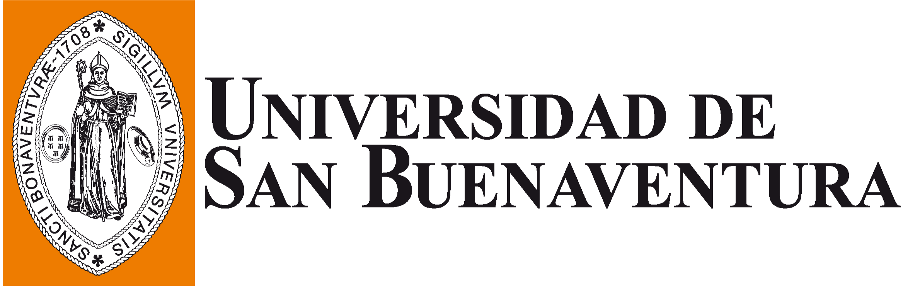

  
  &nbsp;&nbsp;&nbsp;&nbsp;&nbsp;&nbsp;
  

# DSP Board HAL
## English
[In development]  
This repository have a custom HAL libraries to DSP Board used by software development kit _DSP Board SDK_

### Repository Structure

* **docs**  
  This folder contains a doxygen generated documentation of source code (English) [API Documentation](https://daguirrem.github.io/DSPBoardHAL/index.html)

* **src**  
  This folder contains a source code of each libary:  
  * [adc](src/adc)
  * [delay](src/delay)
  * [flash](src/flash)
  * [gpio](src/gpio)
  * [rcc](src/rcc)
  * [dsp](src/dsp)  
   
  
  Every library have a source code folder and the test folder.

* **include**  
  This folder contains a library include files used by _DSP Board SDK_

* **examples**  
  This folder contains a DSP Board examples and HAL examples

### License
  _DSP Board HAL_ is licensed by MIT License, more information on [LICENSE.md](LICENSE.md)

## Español
[En desarrollo]  
Este repositorio contiene las librerías HAL para la tarjeta _DSP Board_ usadas por el kit de desarrollo de software _DSP Board SDK_

### Estructura del repositorio

* **docs**  
  Esta carpeta contiene la documentación de la fuente de código generada por doxygen (Inglés) [Documentación de la API](https://daguirrem.github.io/DSPBoardHAL/index.html)

* **src**  
  Esta carpeta contiene el codigo fuente de las siguientes librerías:  
  * [adc](src/adc)
  * [delay](src/delay)
  * [flash](src/flash)
  * [gpio](src/gpio)
  * [rcc](src/rcc)
  * [dsp](src/dsp)  
   
  
  Cada una de las librerías contiene su carpeta de código fuente y de pruebas.

* **include**  
  Esta carpeta contiene los _include_ de las librerías usadas por _DSP Board SDK_

* **examples**  
  Esta carpeta contiene ejemplos de uso del HAL y de la tarjeta de desarrollo

### Licencia
  _DSP Board HAL_ es licenciado bajo licencia MIT, más información en [LICENSE.md](LICENSE.md)