# DSP Board SDK

El kit de desarrollo de software para la tarjeta se puede descargar mediante el siguiente [link](https://github.com/daguirrem/DSPBoardHAL/releases) del apartado *Release*.

## Instalación del SDK.

### Requisitos. 

- Windows 10 x86_64 o superior.
- https://code.visualstudio.com/docs/supporting/requirements

Opcionalmente,

- Depurador STLink V2 o BlackMagic probe.

### Empezando...

1. Descargar SDK del [link](https://github.com/daguirrem/DSPBoardHAL/releases) proporcionado.

2. Iniciar instalador.

3. Elegir ruta de instalación (Por defecto se instala en ~/.dspboard [E.j. C:\\Users\\David\\.dspboard]). Es muy importante que la ruta de instalación no tenga ningún espacio.

    

    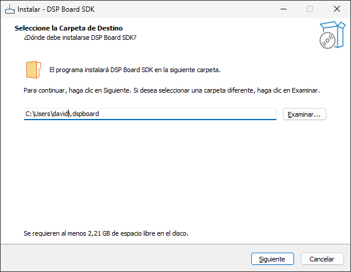
    

4. Proceder a instalar.
    

    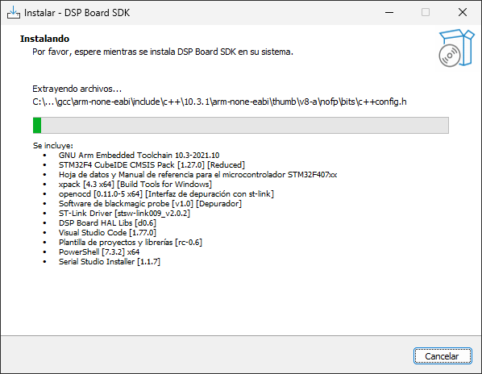
    

5. Seguir las instrucciones para instalar los drivers del depurador con el que se cuenta (Se pueden instalar los 2).

    

    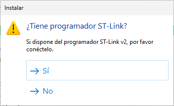
    

    

    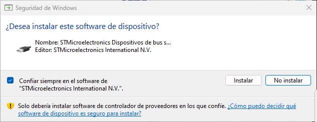
    

    

    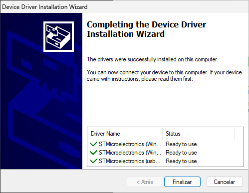
    

6. Al finalizar la instalación se creará un acceso directo en el escritorio llamado *DSP Board IDE*.

## Compilando un ejemplo

Para compilar un ejemplo, es necesario ir a la carpeta de instalación->lib->hal->examples. Por ejemplo C:\Users\David\\.dspboard\lib\hal\examples\basic\gpio\led_blink.

Una vez en la carpeta, hacer click derecho para desplegar el menú de opciones: (En caso de estar en Windows 11, click adicional en ver más opciones)

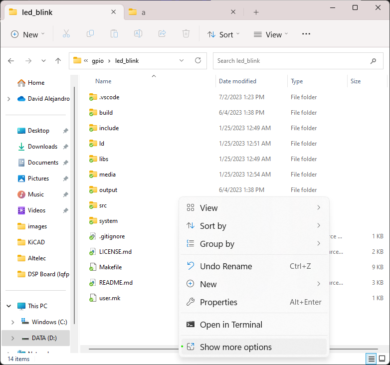

Debe aparecer un nuevo item titulado "Abrir con DSP Board IDE"

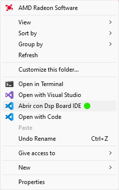

Al realizar click se debe abrir la siguiente ventana:

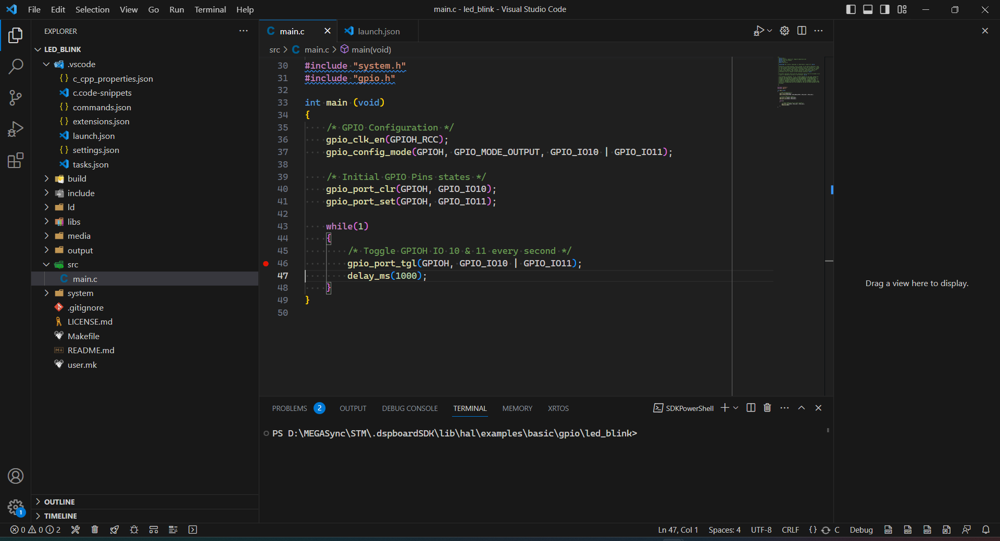

En la parte inferior del programa se encuentra la barra de herramientas, que permite, construir, programar y depurar la tarjeta.

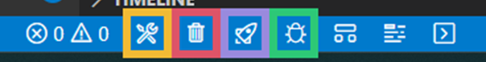

El recuadro naranja, permite construir el programa, el rojo, limpiar el proyecto, el morado (construir y) programar la tarjeta, y el verde (construir) programar y depurar la tarjeta.

Al realizar click en el recuadro naranja se debe construir el proyecto de la siguiente manera:

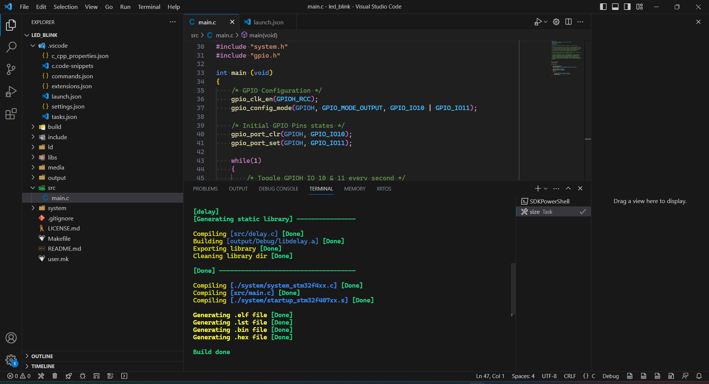

Debe aparecer el tamaño del programa generado de la siguiente manera:

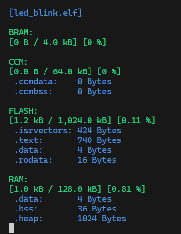

Para programar se debe hacer click en el recuadro morado, y previamente conectado el depurador/programador STLink V2; En consoloa se deben ver las siguientes líneas para verificar su correcta programación.

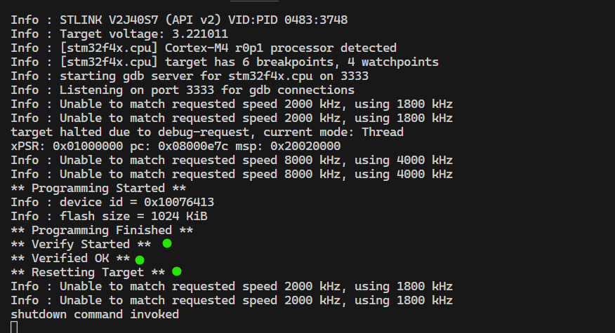

## Creando un nuevo proyecto

Meidante el explorador de archivos de windows se debe dirigir a la carpeta donde se desea crear un nuevo proyecto (E.j. Documentos/dsp_board/hola_mundo). La ruta elegída no debe tener ningún espacio. Estando allí se debe realizar el mismo procedimiento para abrir el DSP Board IDE mencionado anteriormente (Click derecho -> Abrir con DSP Board IDE)

Debe aparecer un nuevo item titulado "Abrir con DSP Board IDE"

Al realizar click se debe abrir una ventana en limpio de DSP Board IDE, A continuación se debe realizar click derecho en la zona de archivos (Punto morado) y localizar el item "Create project from template" (Punto Rojo) y realizar click:

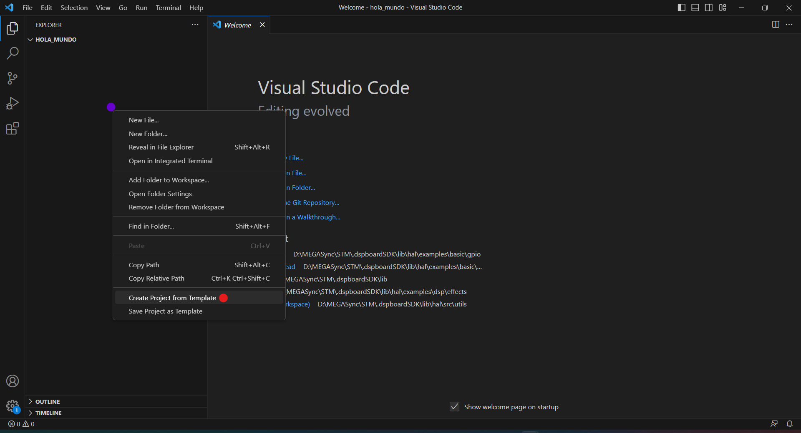

Al realizar click, en la parte superior del DSP Board IDE aparecerán 2 opciones para seleccionar, se debe seleccionar el que se titula "stm32F4xx_GCC" (Punto Rojo)

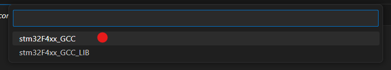

Se van a crear una serie de archivos y carpetas, se debe localizar la carpeta "src" (Punto morado) y sobre ella dar click derecho para crear un nuevo archivo "main.c"

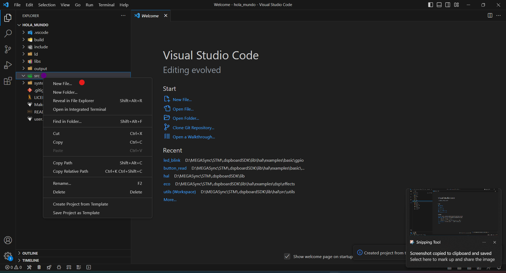

Finalmente, sobre el nuevo archivo se puede empezar a escribir código, existe un atajo de teclado para crear la plantilla base del archivo main.c, para ello, sobre el nuevo archivo creado, escribir mc, y el DSP Board IDE debe sujerir una opción denomidada mc newMain, si no aparece se debe presionar al tiempo las teclas ctrl + espacio.

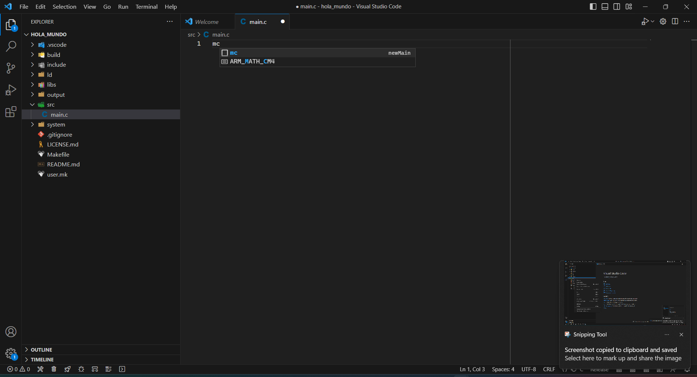

Al dar con la tecla "tab" se debe autocompletar la plantilla, finalmente, sobre la plantilla se puede empezar a escribir el código deseado, y compilar, programar y depurar de la misma manera que con el ejemplo.

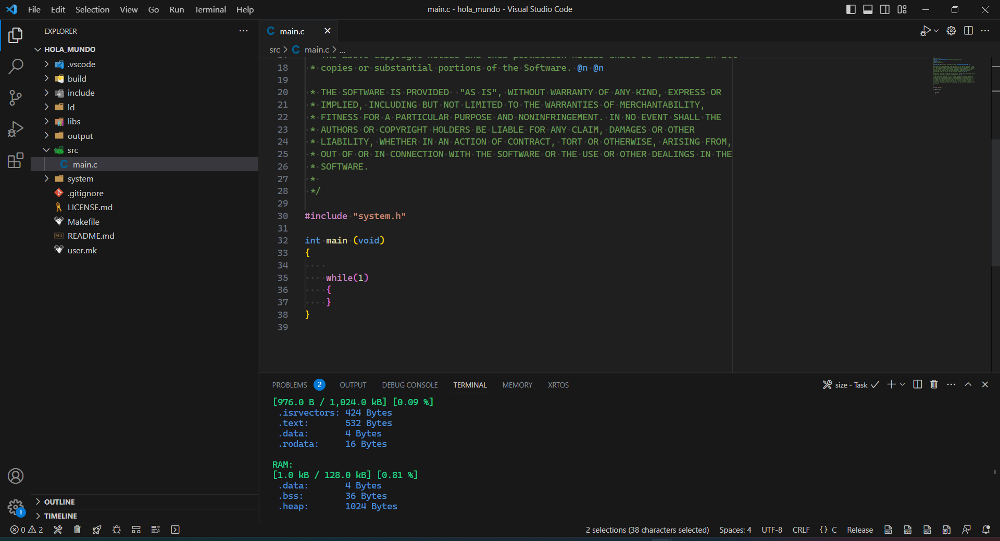

