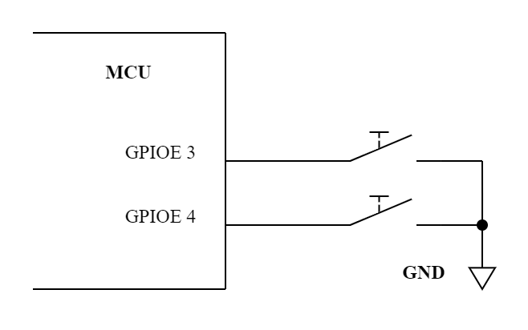
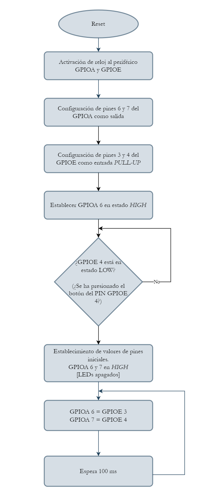

# Button Read

## Descripción:

En el siguiente ejemplo se demuestra la configuración básica del periférico GPIO para leer dos botones conectados a la placa de desarrollo.  
En primera instancia se demuestra cómo leer múltiples entradas GPIO en una sola instrucción, por lo cual, se ha planteado encender un LED al comienzo del programa, y esperar a que se presionen 2 botones para que se apague el LED. Al realizar esto, el programa continua su ejecución.  
El programa consiste en pasar el estado de presionado de los botones a cada uno de los LEDs que se tienen conectados a la placa (Cada led corresponde a un botón).

## Consideraciones:
Para el ejemplo se tienen las siguientes consideraciones:

* Los botones están conectados al pin **3** y **4** del **GPIOE** de la siguiente manera:

    <p align="center">
        
    </p>

* Por lo anterior, los pines se deben configurar con la *pull-up* interna del microcontrolador. Así mismo, la lectura de ***HIGH*** indíca que **no** se ha presionado el botón mientras que la lectura de ***LOW*** indíca que se ha presionado.

**Notas:**  
1. Se entienden como estados *HIGH* y *LOW* cuando la salida del pin es VDD y GND respectivamente.
2. La conexión de los LEDs se encuentra en el ejemplo [led_blink](../led_blink/README.md)

## Diagrama de flujo:

<p align="center">
    
</p>

## Explicación del código:

### Includes

El archivo *system.h* contiene macros, definiciones e includes que son necesarios para la correcta compilación del código.  

En primera instancia es necesario incluir el archivo *gpio.h* que hace parte de las librerías de *DSP Board Hal* para acceder a las funciones relacionadas con el periférico.

```C
#include "system.h"
#include "gpio.h"
...
```
### Configuración del GPIO
1. Es necesario realizar la activación del reloj del periférico GPIO debido a que por defecto todos los periféricos tienen apagado su reloj [ahorro de energía]. Para este caso, se realiza la activación en el GPIOA y GPIOE mediante la línea *gpio_clk_en(GPIOx_RCC)*.

2. Se configuran los pines 6 y 7 del GPIOA para que actúen como GPIOs de salida.

3. Se configuran los pines 3 y 4 del GPIOE para que actúen como GPIOs de entrada con una configuración de *pull-ups*.

3. Se define el estado inicial de los LEDs escribiendo en todo el puerto un valor de 0x80 lo que activa el LED 6 y apaga el LED 7.

```C
...
int main (void)
{
    /* 1 */
    gpio_clk_en(GPIOA_RCC | GPIOE_RCC);
    /* 2 */
    gpio_config_mode(
        GPIOA, GPIO_MODE_OUTPUT, GPIO_IO7 | GPIO_IO6);
    /* 3 */
    gpio_config_all(
        GPIOE,
        GPIO_CONFIG_MODE_INPUT | GPIO_CONFIG_PULL_UP,
        GPIO_IO4 | GPIO_IO3);
    /* 4 */
    gpio_port_write(GPIOA, GPIO_IO7);
}
```

### Lectura de los botones
La función *gpio_port_read_mask* se encarga de retornar el estado en la entrada de los pines especificados en la máscara [*mask*] de un puerto [En este caso en el puerto E los pines 3 y 4].  
El siguiente bloque de código pretende buclear el programa ["detener" o no hacer nada mientras la condición que está dentro del while no se cumpla] mientras los 2 botones no sean presionados al tiempo. Si se presiona alguno de los botones, la función retornará alguno de los siguientes valores: 0b**0**1000 (Indicando que el botón en pin 4 se ha presionado) y 0b1**0**000 (Indicando que el botón en pin 3 se ha presionado)
sin embargo, cuando los 2 botones sean presionados, se retornará el valor 0b**00**000. Es por ello que mientras la lectura de los botones sea diferente a 0 el programa **no** va a continuar con su ejecución.

```C
...
int main (void)
{
    ...
    while(
        gpio_port_read_input_mask(
            GPIOE, GPIO_IO4 | GPIO_IO3) != 0
    );
    ...
    while(1) {...
}
```

### Estado de botones a LEDs
1. Se realiza la lectura de los botones, y el estado se almacena en la variable de 16 bits *port*.
2. Como el resultado corresponde a los pines 3 y 4 del purto, se debe realizar un corrimiento de bits hacia la izquierda de 3 posiciones, de tal manrera que, por ejemplo se tiene el siguiente valor en *port*: 0b00010000, al realizar el corrimiento de 3 posiciones, el nuevo valor de *port* será: 0b1000000. Esto traslada el estado de los pines 3 y 4 a los pines 6 y 7.
3. Mediante el método *gpio_port_write* se escribe en RAW (todo el puerto) el valor que se tenga almacenado en port.
4. Finalmente se mantiene un delay de 100 ms para continuar con la nueva lectura de los botones.
```C
...
int main(void)
{
    ...
    while(1)
    {
        /* 1 */
        uint16_t port = gpio_port_read_input_mask(
            GPIOE, GPIO_IO4 | GPIO_IO3
        );
        /* 2 */
        port <<= 4;
        /* 3 */
        gpio_port_write(GPIOA, port);
        /* 4 */
        delay_ms(100);
    }
}
...
```

## Resultados esperados:
Se espera que al terminar el ejemplo se tenga el siguiente comportamiento:

<p align="center">
    
</p>

## Licencia
Licencia MIT, más información en [LICENSE.md](LICENSE.md).

