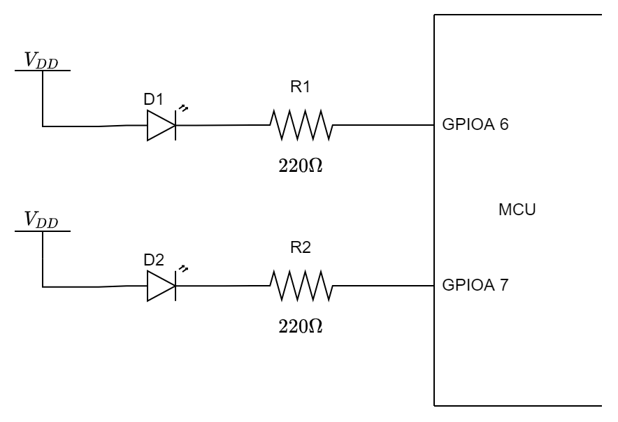
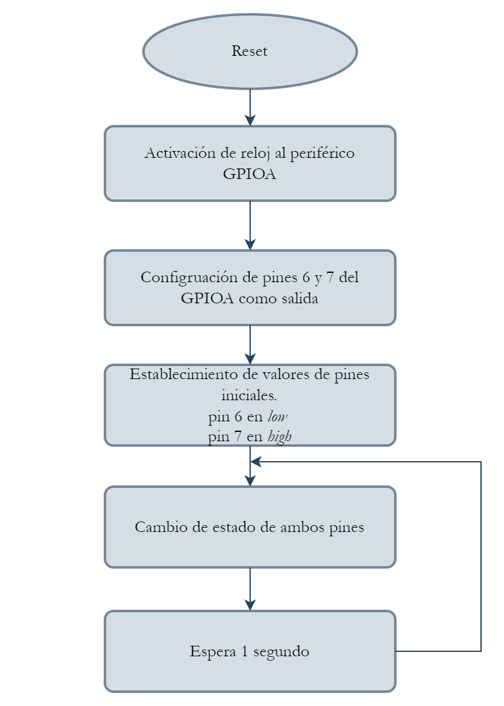

# LED Blink

## Descripción:

En el siguiente ejemplo se demuestra la configuración básica del periférico GPIO para realizar el parpadeo en 2 leds.

## Consideraciones:
Para el ejemplo se tienen las siguientes consideraciones:

* Los LEDs están conectados al pin **6** y **7** del **GPIOA** de la siguiente manera:

    <p align="center">
        
    </p>

* Por lo anterior, los LEDs se **apagan** cuando el PIN está en estado ***HIGH*** <sup>1</sup> y se **encienden** cuando el PIN está en estado ***LOW*** <sup>1</sup>.  

**Notas:**  
1. Se entienden como estados *HIGH* y *LOW* cuando la salida del pin es VDD y GND respectivamente.

## Diagrama de flujo:

<p align="center">
    
</p>

## Explicación del código:

### Includes

El archivo *system.h* contiene macros, definiciones e includes que son necesarios para la correcta compilación del código.  

En primera instancia es necesario incluir el archivo *gpio.h* que hace parte de las librerías de *DSP Board Hal* para acceder a las funciones relacionadas con el periférico.

```C
#include "system.h"
#include "gpio.h"
...
```
### Configuración del GPIO
1. Es necesario realizar la activación del reloj del periférico GPIO debido a que por defecto todos los periféricos tienen apagado su reloj [ahorro de energía]. Para este caso, se realiza la activación en el GPIOA mediante la línea *gpio_clk_en(GPIOx_RCC)*.

2. Se configuran los pines 6 y 7 del GPIOA para que actúen como GPIOs de salida.

3. Se define un estado inicial de cada uno de los leds, para el caso del led conectado al pin 6 se tiene un estado de encendido [0] y para el pin 7 se tiene un estado de apagado [1].

```C
...
int main (void)
{
    /* 1 */
    gpio_clk_en(GPIOA_RCC);
    /* 2 */
    gpio_config_mode(
        GPIOA,
        GPIO_MODE_OUTPUT,
        GPIO_IO7 | GPIO_IO6
    );
    /* 3 */
    gpio_port_clr(GPIOA, GPIO_IO6);
    gpio_port_set(GPIOA, GPIO_IO7);
    ...
}
```

### Parpadeo de LED
La función *gpio_port_tgl* se encarga de intercambiar el estado actual de el pin [o los pines] que se pase como argumento. Por lo que, cada vez que se ejecute un ciclo del *bucle* se intercambiarán de estado los leds.  
Por otra parte se ejecuta un retardo de 1 segundo mediante el llamado de la función *delay_ms* integrado dentro de las librerías que se proveen en el SDK.
```C
...
    while(1)
    {
        gpio_port_tgl(
            GPIOA,
            GPIO_IO7 | GPIO_IO6
        );
        delay_ms(1000);
    }
...
```

## Resultados esperados:
Se espera que al terminar el ejemplo los leds parpadeen de la siguiente manera:

<p align="center">
    
</p>

## Licencia
Licencia MIT, más información en [LICENSE.md](LICENSE.md).

