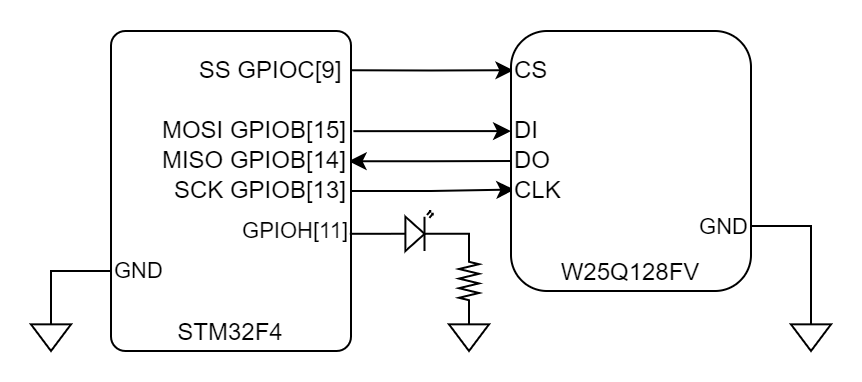
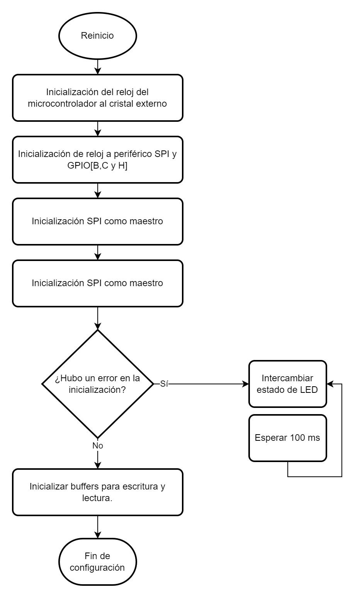
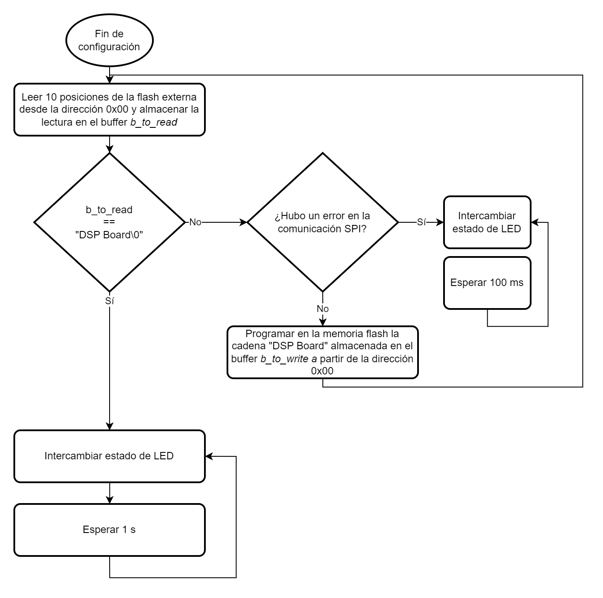
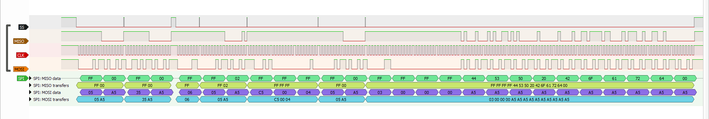

# Memoria flash externa mediante SPI

## Descripción:

El siguiente ejemplo demuestra la implementación del periférico SPI mediante el uso de una memoria flash externa ([Winbond W25Q128FV](https://www.winbond.com/hq/product/code-storage-flash-memory/serial-nor-flash/?__locale=en&partNo=W25Q128FV)), usando la librería [Driver_W25Qxx](https://github.com/iammingge/Driver_W25Qxx) desarrollada por @iammingge.  

Este ejemplo es una guía de configuración del periférico SPI como maestro para que pueda ser usado con una memoria W25Qxx (esclavo), además de ser un ejemplo de cómo adaptar una librería externa para ser compilada mediante el *SDK DSP Board*.  

El flujo de programa hace uso de la memoria flash para verificar y almacenar una cadena de texto ("DSP Board") en la dirección 0 de la memoria flash. Si se ejecuta por primera vez el programa en una memoria virgen (con datos diferentes a la cadena de texto mencionada), El programa forzará la escritura de la cadena en la dirección mencionada, este proceso lo realiza únicamente si en la memoria flash no se encuentra almacenada la cadena deseada.

## Consideraciones:

Para el ejemplo se tienen las siguientes consideraciones:

* El diagrama del circuito se resume en :

    <p align="center">
        
    </p>

* No todos los GPIO se pueden multiplexar al periférico SPI, por tal motivo, se debe revisar la tabla 9 (Alternate function mapping) del [*datasheet*](https://www.st.com/resource/en/datasheet/dm00037051.pdf) del microcontrolador. 

**Notas:**  
1. Más información de la librería de la memoria flash en: [Driver_W25Qxx](https://github.com/iammingge/Driver_W25Qxx).
2. Las modificaciones que se hicieron en la librería externa se pueden detallar [aquí](#consideraciones-librería-externa).

## Diagrama de flujo:

* Inicialización:
    <p align="center">
        
    </p>
* Lectura y escritura:
    <p align="center">
        
    </p>

## Explicación del código:

### Includes

La librería *string.h* se incluye para usar función *strncmp* la cual permite determinar si una cadena de carácteres es igual a otra (almacenados en un buffer).

El archivo *system.h* contiene macros, definiciones e includes que son necesarios para la correcta compilación del código.  

Es necesario incluir los archivos *rcc.h*, *spi.h* y *gpio.h* que hace parte de las librerías de *DSP Board Hal* para acceder a las funciones relacionadas con los periféricos RCC, SPI y GPIO respectivamente.  

Finalmente se incluye la librería *W25Qxx.h* para usar las funciones que permiten inicializar y leer/escribir la memoria flash.

```C
#include <string.h>

#include "system.h"

#include "rcc.h"
#include "spi.h"
#include "gpio.h"

#include "W25Qxx.h"
...
```

### Variables globales

La variable *spi* almacena la configuración del periférico SPI para ser inicializado mediante la librería del SDK. Es una estructura que contiene la siguiente información:

- .spi_p = Dirección del periférico SPI que se va a utilizar (E.j. SPI2)
- .gpio_spi = Dirección del periférico GPIO que se va a utilizar para los pines SCK, MISO, MOSI (E.j. GPIOB)
- .gpio_ss = Dirección del periférico GPIO que se va a utilizar para los pines SS (Slave Select) o también llamados CS (Chip Select). (E.j. GPIOC)
- .sck_pin, .miso_pin, .mosi_pin = Máscara de pines usados para la señal SCK, MISO, MOSI respectivamente. (E.j. .sck_pin = GPIO_IO15)
- .ss_pin = Arreglo de máscara de pines usados para la(s) señal(es) SS. (E.j. {GPIO_IO9} [Se usa únicamente un pin para el SS, aún así pueden ser hasta el número declarado en la definición SPI_SS_MAX_SIZE])
- .ss_size = Cantidad de GPIOs declarados en .ss_pin (E.j. 1 [Solo un pin])
- .software_ss = Habilita o deshabilita el control por *Software* del pin SS, en caso de que no esté habilitada, se usa el control por *Hardware*. (E.j. *true* o *false*)
- .clk_prescaler = Prescaler del bus del SPI a configurar. (E.j. SPI_PRESCALER_256)
- .data_format = Formato de datos, puede ser 8 o 16 bits. (E.j. SPI_DF_8BITS)
- .transfer_format = Formato de transferencia, puede ser MSB o LSB donde MSB corresponde a enviar primero el bit más significativo, o LSB corresponde a enviar primero el bit menos significativo. (E.j. SPI_TF_MSB)
- .mode = Modo de transferencia SPI. Puede ser 0, 1, 2 o 3. (E.j. SPI_MODE_3). (Debe declararse uno de los 2: .mode o .clk_pol y .clk_pha)
- .clk_pol = (Complementario a .mode) Selecciona la polarización de la señal SCK en estado IDLE. (E.j. SPI_CLK_POL_HIGH).  
- clk_pha = (Complementario a .mode) Selecciona la fase de transferencia de datos. (E.j. SPI_CLK_PHA_SECOND)

```C
static spi_t spi =
{
    /* Uso de SPI 2 */
    .spi_p = SPI2,

    /* GPIOB (SCK:13, MISO:14, MOSI:15) GPIOC (SS:9) */
    .gpio_spi = GPIOB, .gpio_ss = GPIOC,
    .sck_pin = GPIO_IO13, .miso_pin = GPIO_IO14, .mosi_pin = GPIO_IO15,
    .ss_pin = {GPIO_IO9}, .ss_size = 1,
    /* Selección de esclavo por software */
    .software_ss = true,

    /* Reloj de SPI más lento (Prescaler máximo) */
    .clk_prescaler = SPI_PRESCALER_256,

    /* Trasmisión de 8 bits */
    .data_format = SPI_DF_8BITS,
    /* Envío de tipo MSB (Primer bit es el más significativo) */
    .transfer_format = SPI_TF_MSB,

    /* SPI Modo 3 (La memoria W25Qxx es compatible con el modo 0 y 3) */
    .mode = SPI_MODE_3
};
...
int main (void)
{
    ...
}
```

### Declaración de funciones para la librería Driver_W25Qxx

La librería *Driver_W25Qxx* requiere de 4 funciones para su funcionamento:
1. spi_delay_ms: Función para retardo en milisegundos. La función debe ser de tipo void(uint32_t). Por tanto la función *delay_ms* integrada en el SDK funciona.
2. spi_cs_L: Función para poner en bajo el pin SS utilizado en la memoria flash. La función debe ser de tipo void(void). Por tanto se crea una función (W25Qxx_ss_low) para ajustar la función del SDK. En esta se llama *gpio_port_clr* para poner en bajo el pin GPIOC[9].
3. spi_cs_H: Función para poner en alto el pin SS utilizado en la memoria flash. La función debe ser de tipo void(void). Por tanto se crea una función (W25Qxx_ss_high) para ajustar la función del SDK. En esta se llama *gpio_port_set* para poner en alto el pin GPIOC[9].
4. spi_rw: Función para lectura y escritura mediante SPI. La función debe ser de tipo uint8_t(uint8_t). Por tanto se crea una función (W25Qxx_spi) para ajustar la función del SDK. En esta se llama la función *spi_master_write_and_read_raw* y se le pasa como argumento la variable *spi* y *data* de tal manera que queda del tipo deseado.

```C
...
static void W25Qxx_ss_low(void)
{
    gpio_port_clr(GPIOC, GPIO_IO9);
}

static void W25Qxx_ss_high(void)
{
    gpio_port_set(GPIOC, GPIO_IO9);
}

static uint8_t W25Qxx_spi(uint8_t data)
{
    return (uint8_t) spi_master_write_and_read_raw(&spi, data);
}
...
int main (void)
{
    ...
}
```

### Funciones adicionales

Se declaran 2 funciones adicionales que notifican mediante el LED la correcta (o incorrecta) ejecución del programa.

1. board_error_handler: Notifica un error, deteniendo el flujo de programa, y haciendo parpadear el led cada 100 ms (Rápidamente).
2. board_ok_handler: Notifica que todo está bien, deteniendo el flujo de programa, y haciendo parpadear el led cada segundo (Lentamente).

```C
...
/* 1 */
static void board_error_handler(void)
{
    do {
        gpio_port_tgl(GPIOH, GPIO_IO11);
        delay_ms(100);
    } while (1);
}

/* 2 */
static void board_ok_handler(void)
{
    do {
        gpio_port_tgl(GPIOH, GPIO_IO11);
        delay_ms(1000);
    } while (1);
}

int main (void)
{
    ...
}
```

### Configuración del *clock* del sistema
1. Con la función *rcc_sysclk_select* se cambia la fuente de reloj del microcontrolador, el parámetro *RCC_SYSCLK_HSE* determina como fuente el cristal externo de la placa, en este caso @8 MHz.

```C
...
int main (void)
{
    /* 1 */
    rcc_sysclk_select(RCC_SYSCLK_HSE);
    ...
}
```

### Inicialización de los *clocks* de los periféricos
Se plantea el uso de 4 periféricos para el ejemplo, el primero es el SPI2, y luego los GPIO B, C y H. El GPIO B, como se menciona en [Variables globales](#variables-globales), se usará para las señales SCK, MISO y MOSI del periférico SPI. Por otra parte, el GPIO C se usará para la señal SS. Finalmente, el GPIO H se usará para controlar el LED de la placa, el cual mediante un parpadeo indacará la correcta (o incorrecta) ejecución del programa.

```C
...
int main (void)
{
    spi_clk_en(SPI2_RCC);
    gpio_clk_en(GPIOB_RCC | GPIOC_RCC | GPIOH_RCC);
    ...
}
```

### Configuración GPIO
1. Mediante *gpio_config_mode* se configura el GPIOH[11] como salida (*GPIO_MODE_OUTPUT*) para controlar el LED de la board. Este LED funciona para depurar la correcta ejecución del programa. Al tener un correcto funcionamiento, el LED parpadeará lentamente con un periodo de 1 segundo; Si ocurre algún error, el LED parpadeará rápidamente con un periodo de 100 ms.
```C
...
int main (void)
{
    ...
    gpio_config_mode(GPIOH, GPIO_MODE_OUTPUT, GPIO_IO11);
    ...
}
```

### Inicialización del periférico SPI.

1. La inicialización y configuración del SPI como maestro se hace mediante la función *spi_master_init* la cual espera como argumento la dirección de la variable global *spi*. Internamente la función configura los GPIO declarados en .gpio_spi y .gpio_ss con la máscara correspondiente .sck_pin, .miso_pin, .mosi_pin. Y el arreglo de SS pasado en .ss_pin para que puedan ser usados por el periférico.

```C
...
int main(void)
{
    ...
    spi_master_init(&spi);
    ...
}
...
```

### Configuración Librería W25Qxx

Según el [ejemplo](libs/W25Qxx/example.c) proporcionado por el desarrollador, para inicializar la memoria flash se debe configurar de la siguiente forma:

1. Se debe declarar una variable de tipo W25Qxx_ERR que funcione como una bandera de errores. Los errores que se pueden presentar, están descritos en el archivo [W25Qxx.h#148](libs/W25Qxx/include/W25Qxx.h?plain=1#L148). Todas las funciones usadas por la librería requieren de esta bandera para notificar ante algún posible error de comunicación/configuración. En caso de que no se presente ningún error se tendrá el valor W25Qxx_ERR_NONE.

2. Se asigna la función de retardo en milisegundos a la variable W25Qxx. Esta función debe ser de tipo void(uint32_t). Como la función *delay_ms* del SDK cumple esta característica puede ser asignada directamente.

3. Se asigna la función de transferencia SPI, adaptada en [W25Qxx_spi](#declaración-de-funciones-para-la-librería-driver_w25qxx).

4. Se asigna la función de SS en alto, adaptada en [W25Qxx_ss_high](#declaración-de-funciones-para-la-librería-driver_w25qxx).

5. Se asigna la función de SS en bajo, adaptada en [W25Qxx_ss_low](#declaración-de-funciones-para-la-librería-driver_w25qxx).

6. Se llama la función *W25Qxx_config* que realiza la secuencia de inicialización de la memoria flash.

7. Se verifica la bandera *err* para determinar que no existe ningún error en la inicialización, en caso de que se presente algún problema (E.j. Error en la conexión con la memoria) se llama la función *board_error_handler* la cual detiene el flujo de programa, y realiza el parpadeo cada 100 ms del LED de la placa.  

**Nota:**
La variable W25Qxx está definida dentro de la librería proporcionada. Por tanto **no** hay que declararla en algún punto del programa.

```C
...
int main(void)
{
    ...
    /* 1 */
    W25Qxx_ERR err;
    /* 2 */
    W25Qxx.port.spi_delayms = delay_ms;
    /* 3 */
    W25Qxx.port.spi_rw = W25Qxx_spi;
    /* 4 */
    W25Qxx.port.spi_cs_H = W25Qxx_ss_high;
    /* 5 */
    W25Qxx.port.spi_cs_L = W25Qxx_ss_low;
    /* 6 */
    W25Qxx_config(&err);
    
    /* 7 */
    if (err != W25Qxx_ERR_NONE)
    {
        board_error_handler();
    }
    ...
}
...
```

### Lectura y escritura de la memoria flash
1. Se declaran dos buffers de tipo uint8_t para almacenar cadenas de carácteres que se desean escribir o leer de la memoria flash. En el caso de la escritura, se inicializa con el texto "DSP Board".

2. Se ejecuta la rutina de lectura de la memoria mediante la función *W25Qxx_Read* donde se pasan como argumentos:
    - Dirección del buffer donde se almacenarán los datos leídos (b_to_read)
    - Dirrección de memoria en 32 bits desde la que se desea leer la flash (0x00000000)
    - Cantidad de posiciones que se desean leer de la flash (10 debido a que el texto "DSP Board" es de 10 posiciones, contando el '\0' del final de una cadena de texto)

3. Comprobación de cadenas de texto, donde se espera que el buffer de lectura (b_to_read) contenga la cadena "DSP Board".

4. En caso de que **no** contenga la cadena deseada, verificar si existe un error en la lecura de la memoria, y ejecutar *board_error_handler* en caso de que corresponda.

5. En caso de que el problema no sea de comunicación (Memoria virgen), se realiza la escritura de la cadena desde la dirección deseada en la memoria flash, mediante la función *W25Qxx_Program*, la cual espera como argumentos:
    - Dirección del buffer que se desea escribir (Puede ser directamente la cadena de texto).
    - Dirrección de memoria en 32 bits desde la que se desea escribir la flash (0x00000000)
    - Cantidad de posiciones que se desean escribir de la flash (10 debido a que el texto "DSP Board" es de 10 posiciones, contando el '\0' del final de una cadena de texto).  

6. En caso de que la comprobación de cadenas de texto sea correcta, es decir, *b_to_read* contenga la cadena "DSP Board" ejecutar la función *board_ok_handler* la cual detiene el flujo de programa y notifica mediante un parpadeo lento (T = 1 s) en el LED de la placa que todo se ejecutó correctamente.

**Nota:** La dirección de escritura/lectura de la flash se escribe como 0x00000000 con fines simplemente ilustrativos, para hacer alución de que es una dirección de 32 bits, por tanto puede ser también escrita como 0 ó 0x0.

```C
...
int main(void)
{
    ...
    /* 1 */
    uint8_t b_to_write[10] = "DSP Board";
    uint8_t b_to_read[10] = "";

    while(1)
    {
        /* 2 */
        W25Qxx_Read(b_to_read, 0x00000000, 10, &err);

        /* 3 */
        if (strncmp((const char *)b_to_read, (const char *)b_to_write, 10) != 0)
        {
            /* 4 */
            if (err != W25Qxx_ERR_NONE)
            {
                board_error_handler();
            }

            /* 5 */
            W25Qxx_Program(b_to_write, 0x00000000, 10, &err);
        }
        else
        {
            /* 6 */
            board_ok_handler();
        }
    }
}
```

## Resultados esperados:
Se espera que al terminar el ejemplo se tenga el siguiente comportamiento:

<p align="center">
    
</p>

El archivo *output_signal.sr* en [media](media) se puede abrir con PulseView para más detalle.

## Consideraciones librería externa:
- La librería debe tener una estructura de carpetas específica para que pueda ser compilado por el SDK, por tanto los archivos [W25Qxx.h](libs/W25Qxx/include/W25Qxx.h) y [W25Qxx.c](libs/W25Qxx/src/W25Qxx.c) se guardaron de la siguiente manera:

    ```
    | libs
        | include
            - W25Qxx.h
        | src
            - W25Qxx.c

    Nota: 
    | = Carpeta
    - = Archivo
    ```

    Cualquier archivo fuera de la carpeta *include* y *src* no se tiene en cuenta en la compilación del SDK, por tanto, el archivo [example.c](libs/W25Qxx/example.c) no se compila, solo es un archivo de referencia.

- Hay un bug en la librería en la función *W25Qxx_ReadStatus*, Se usa incorrectamente el operador XOR ya que los posibles estados de la memoria son 1, 2, 4 y 8, correspondientes a *IDLE*, *BUSY*, *SUSPEND* y *BUSY AND SUSPEND* respectivamente, sin embargo el operador XOR devuelve un estado incorrecto al que realmenete reporta la memoria. Por ejemplo, La memoria en estado "IDLE" devuelve en la variable *ret* el valor de 0 y la operación 2^0 = 2 Por tanto devuelve erroneamente el estado *BUSY*.
Para solucionar este error se puede usar la función *pow* dentro de la librería *<math.h>* o por sugerencia del autor realizar un corrimiento hacia la izquierda de la forma (1 << ret). Más información en el *issue* [Is XOR operator an error on W25Qxx_ReadStatus?](https://github.com/iammingge/Driver_W25Qxx/issues/1)

    Original

    ```C
    uint8_t W25Qxx_ReadStatus(void)  /* Read current chip running status */
    {
        uint8_t ret = 0;

        ret |= W25Qxx_RBit_BUSY();
        ret |= W25Qxx_RBit_SUS()<<1;

        return (2 ^ ret); 
        /* ^ CAUSA FALSA BANDERA DE ERROR */
    }
    ```  
    Corregido

    ```C
    ...
    #include <math.h>
    ...
    uint8_t W25Qxx_ReadStatus(void)  /* Read current chip running status */
    {
        uint8_t ret = 0;

        ret |= W25Qxx_RBit_BUSY();
        ret |= W25Qxx_RBit_SUS()<<1;

        return ((uint8_t) 1 << ret);
    }
    ```
## Licencia
Licencia MIT, más información en [LICENSE.md](LICENSE.md).

