# MATLAB
El siguiente documento describe cómo generar los coeficientes B para el filtro de tipo FIR y cómo generar el archivo fir_coeff.h mediante MATLAB.

## Prerequisitos  

Tener instalado los siguientes toolbox en MATLAB:
- DSP System Toolbox
- Signal Processing Toolbox

## Empezando

En primera instancia se debe abrir el archivo [fir_coeff_generator.m](matlab/fir_coeff_generator.m) mediante MATLAB, y ejecutamos el script mediante el comando RUN.

<p align="center">
    
</p>

Al ejecutar el script, se va a mostar una advertencia en la consola de MATLAB, e inmediatamente después se va a abrir *Filter Designer*, en caso de que salga un error, verificar que se tienen los prerequisitos. 

<p align="center">
    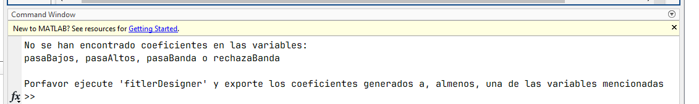
</p>

<p align="center">
    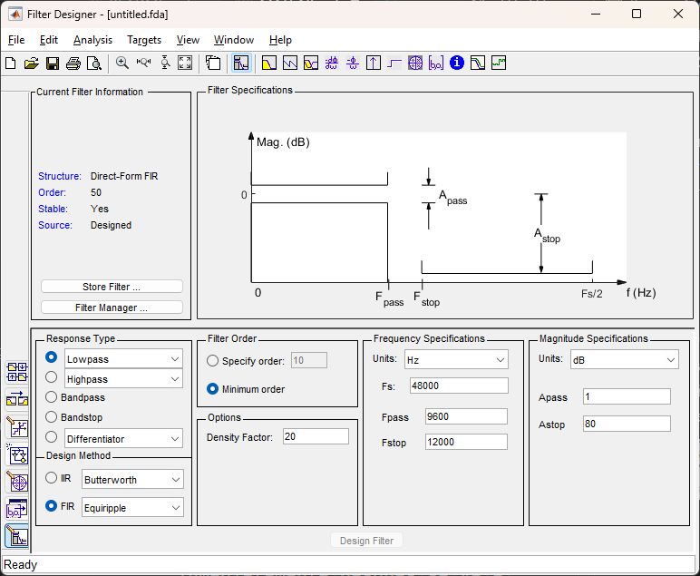
</p>

## Diseñando los filtros

Para diseñar los filtros es necesario sleccionar el tipo de filtro, el método de diseño, el orden y los parámetros de frecuencia de muestreo y de corte(s). Para el script es necesario exportar los coeficientes al *workspace* de MATLAB con alguno de estos nombres.
- pasaBajos
- pasaAltos
- pasaBanda
- rechazaBanda

Se debe exportar con al menos 1 de esos nombres, sin embargo pueden ser 2 o todos los filtros.

Para el ejemplo se realiza el siguiente procedimiento, donde se entiende que se van a generar los coeficientes de todos los filtros.

### Filtro pasa bajos
<p align="center">
    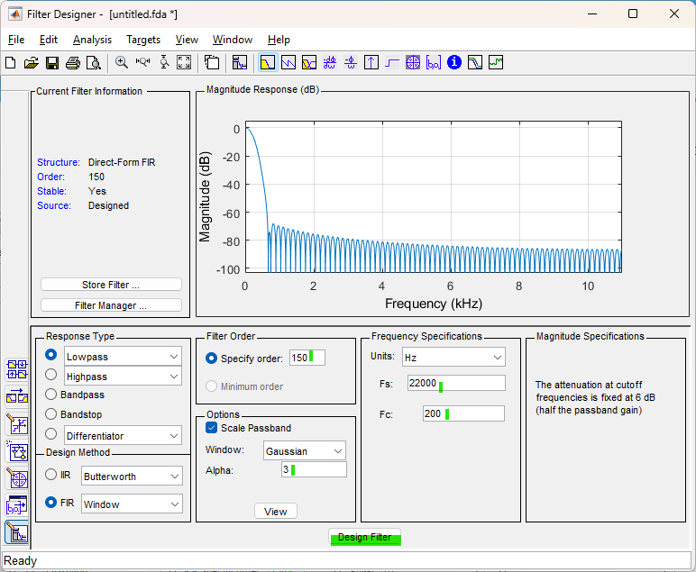
</p>

<p align="center">
    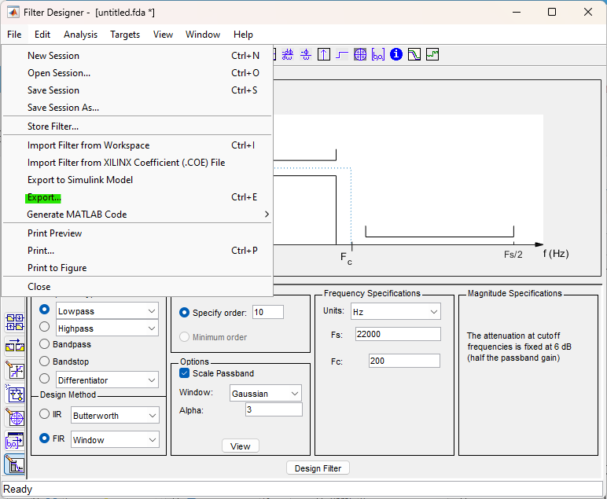
</p>

<p align="center">
    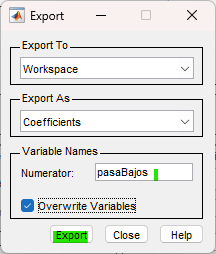
</p>

### Filtro pasa altos
<p align="center">
    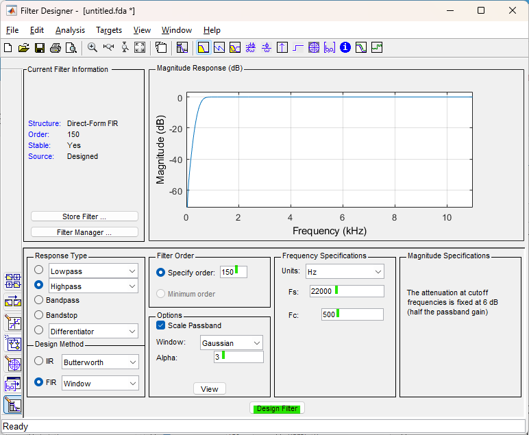
</p>

<p align="center">
    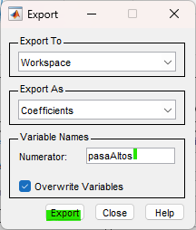
</p>

### Filtro pasa banda
<p align="center">
    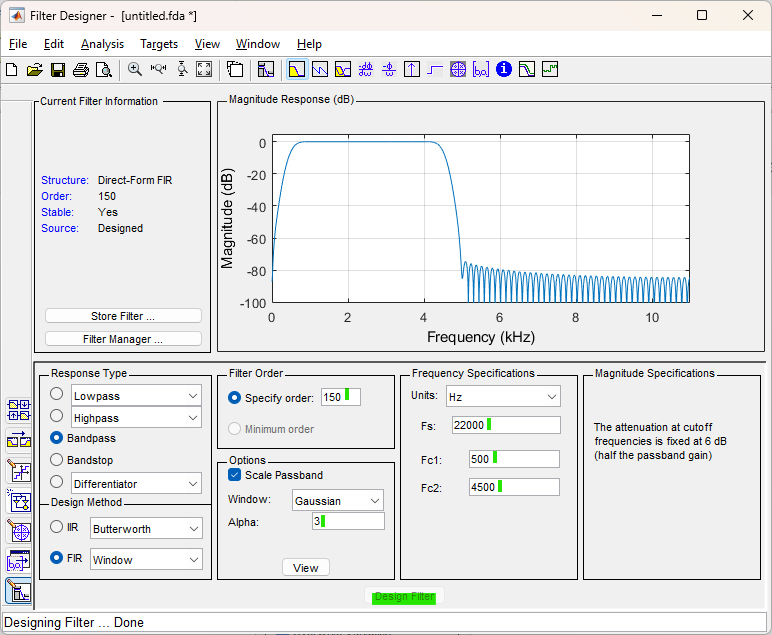
</p>

<p align="center">
    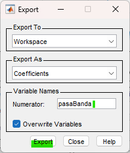
</p>

### Filtro rechaza banda
<p align="center">
    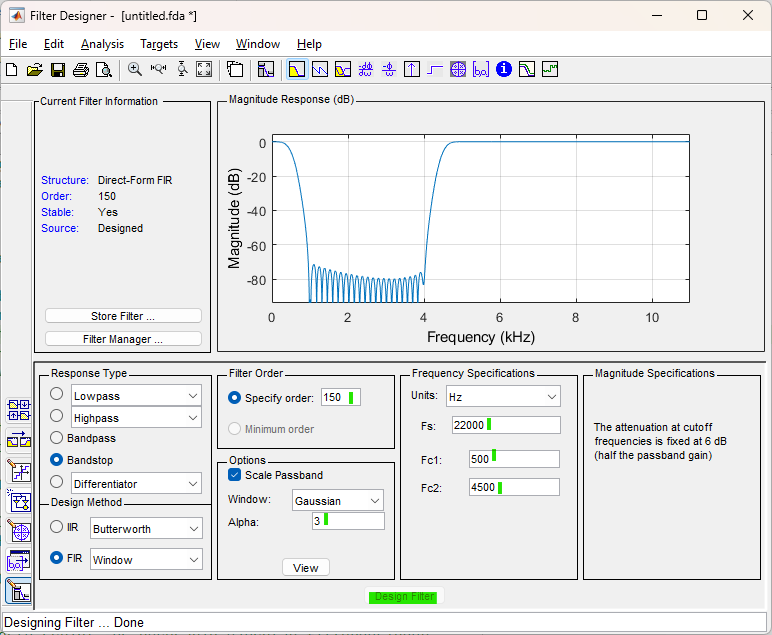
</p>

<p align="center">
    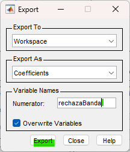
</p>

## Verificar WorkSpace de MATLAB

Verificar que existan las variables en el *workspace* de MATLAB.

<p align="center">
    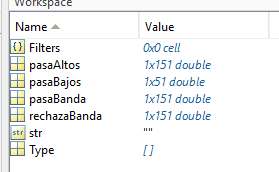
</p>

## Ejecutar script
Volver a ejecutar el script [fir_coeff_generator.m](matlab/fir_coeff_generator.m) para generar el archivo fir_coeff.h

<p align="center">
    
</p>

Al finalizar, se debe ver la consola con el archivo generado y en los archivos, debe haberse creado un archivo llamado *fir_coeff.h*. Este archivo está listo para ser copiado a la carpeta *include* del proyecto.

<p align="center">
    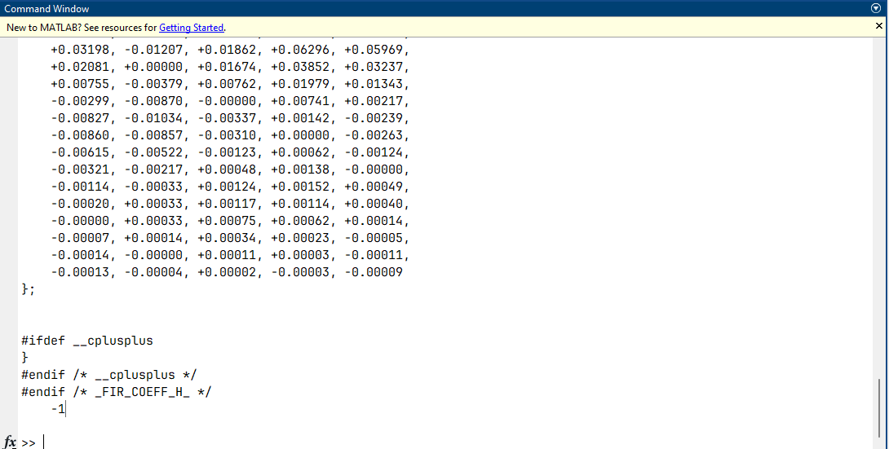
</p>

<p align="center">
    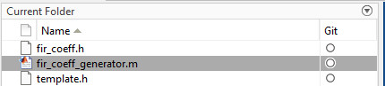
</p>

### fir_coeff.h
Dentro del archivo se generan las siguientes definiciones y variables (dependiendo de cuántos y cuales filtros se diseñaron).

```C
#define FIR_ORDER 150 /* Orden del filtro deseado */


/* Coeficientes B generados, para cada uno de los filtros (Guardados en el espacio CCM de la RAM):
 *  b_low para filtro pasa bajos
 *  b_high para filtro pasa altos
 *  b_pass para filtro pasa banda
 *  b_stop para filtro rechaza banda
 */
__CCM_VAR_I const float b_low[] = {...};
__CCM_VAR_I const float b_high[] = {...};
__CCM_VAR_I const float b_pass[] = {...};
__CCM_VAR_I const float b_stop[] = {...};
```
