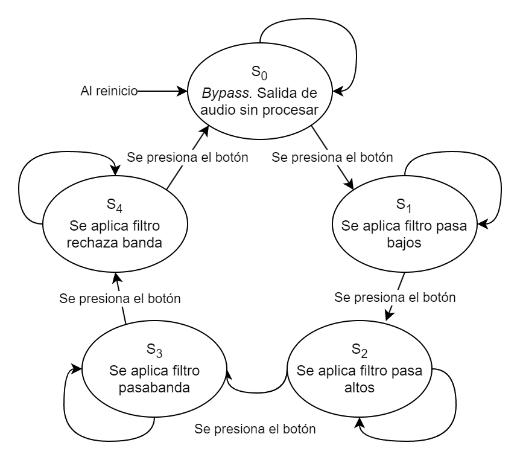
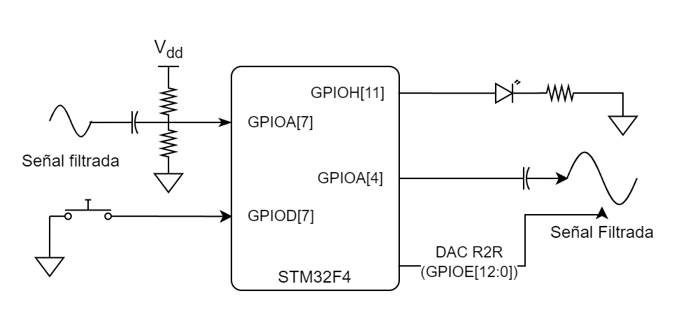
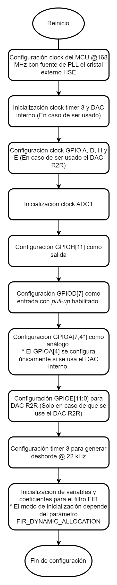
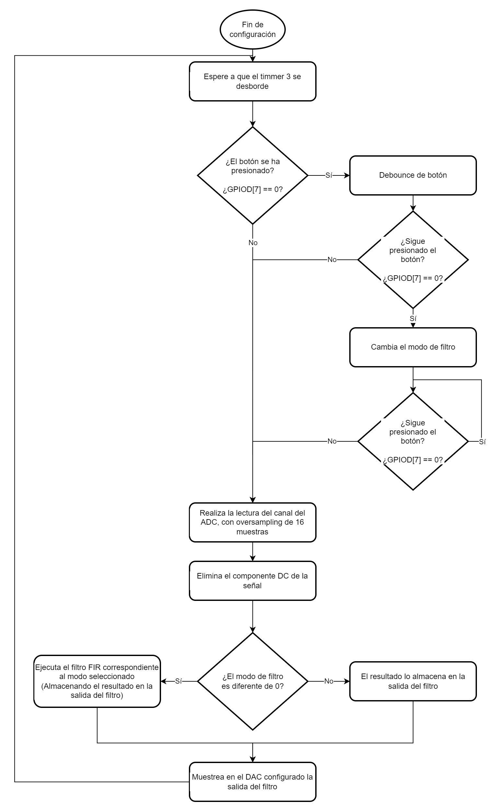

# Filtro FIR

## Descripción:

El siguiente ejemplo demuestra la implementación de un filtro de tipo FIR incluído en la librería [DSP](../../../../src/dsp) en el filtrado de audio. Se implementa un filtro de tipo pasa-bajos, pasa-altos, pasa-banda y rechaza-banda a una tasa de muestreo de 22 kHz y de orden de 150, La intención del ejemplo es demostrar los límites del microcontrolador.  

El programa permite seleccionar el filtro a realizar mediante un botón, de manera secuencial. De tal manera que al reinicio se realiza un *bypass* (con *oversampling* de 16 muestras) del ADC al DAC, y cada vez que se presiona el botón se selecciona un filtro de la siguiente manera:

<p align="center">
    
</p>

Los filtros son generados mediante la herramienta *Filter Designer* de MATLAB, y los coeficientes están almacenados en [fir_coeff.h](include/fir_coeff.h) con la siguiente configuración:

<center>

|Filtro         |Frecuencia de corte|
|---------------|-------------------|
|Pasa bajos     | 200 Hz            |
|Pasa altos     | 500 Hz            |
|Pasa banda     | 500 - 4500 Hz     |
|Rechaza banda  | 500 - 4500 Hz     |

</center>

Todos los filtros están diseñados con una frecuncia de muestreo de 22 kHz implementando el método *"Window"* de tipo *"Gaussian"* con parámetro *"Alpha"* en 3. Para aprender a generar el archivo fir_coeff.h y modificar los parámetros de los filtros ver [MATLAB.md](MATLAB.md).

## Consideraciones:
Para el ejemplo se tienen las siguientes consideraciones:

* El diagrama del circuito se resume en :

    <p align="center">
        
    </p>

* La señal del ADC y del DAC pasan por un filtro de *antialiasing* y de reconstrucción respectivamente @ 192 kHz.

* La entrada del botón (GPIOD[7]) se configura con *pull-up* interna del microcontrolador. Así mismo, la lectura de ***HIGH*** indíca que **no** se ha presionado el botón mientras que la lectura de ***LOW*** indíca que se ha presionado.

**Notas:**  
1. Se entienden como estados *HIGH* y *LOW* cuando la salida del pin es VDD y GND respectivamente.

## Diagrama de flujo:

* Inicialización:
    <p align="center">
        
    </p>
* General:
    <p align="center">
        
    </p>

## Explicación del código:

### Includes

El archivo *system.h* contiene macros, definiciones e includes que son necesarios para la correcta compilación del código.  

En primera instancia es necesario incluir los archivos *adc.h*, *dsp.h*, *rcc.h* y *gpio.h* que hace parte de las librerías de *DSP Board Hal* para acceder a las funciones relacionadas con los periféricos ADC, RCC y GPIO respectivamente, además de las funciones DSP en las que se incluye el filtro de tipo FIR, por otra parte, el archivo *fir_coeff.h* contiene los coeficientes generados para los filtros deseados.

```C
#include "system.h"

#include "adc.h"
#include "dsp.h"
#include "rcc.h"
#include "gpio.h"

#include "fir_coeff.h"
...
```

### fir_coeff.h
Dentro del archivo se tienen las siguientes definiciones y variables.

```C
#define FIR_ORDER 150 /* Orden del filtro deseado */


/* Coeficientes B generados, para cada uno de los filtros (Guardados en el espacio CCM de la RAM):
 *  b_low para filtro pasa bajos
 *  b_high para filtro pasa altos
 *  b_pass para filtro pasa banda
 *  b_stop para filtro rechaza banda
 */
__CCM_VAR_I const float b_low[] = {...};
__CCM_VAR_I const float b_high[] = {...};
__CCM_VAR_I const float b_pass[] = {...};
__CCM_VAR_I const float b_stop[] = {...};
```

## Configuración del programa

El programa se puede configurar en 2 maneras:
1. FIR_DYNAMIC_ALLOCATION: Puede ser 0 y 1 para deshabilitar o habilitar respectivamente. Permite implementar una asignación dinámica o estática de memoria para las variables de tipo FIR.
   
2. DAC_R2R_EN: Puede ser 0 y 1 para deshabilitar o habilitar respectivamente. Permite activar o desactivar el DAC R2R, cuando el DAC R2R está habilitado, el DAC interno del MCU no se usa, y viceversa.

```C
...
/* 1 */
#define FIR_DYNAMIC_ALLOCATION 0

/* 2 */
#define DAC_R2R_EN 1
...
int main (void)
{
    ...
}
```

### Variables globales

La variable *mode* controla el estado en de filrado que se está ejecutando, estos valores pueden ser:

```C
/*Mode: [0] - Sin filtro */
/*      [1] - Pasa Bajos */
/*      [2] - Pasa Altos */
/*      [3] - Pasa Banda */
/*      [4] - Rechaza banda */
uint8_t mode = 0;
...
int main (void)
{
    ...
}
```

### Configuración del *clock* del sistema
1. Para realizar el procesamiento digital de señales a la tasa de muestreo deseada y con el orden de filtro deseado, es necesario configurar a máxima velocidad el microcontrolador, es por ello que mediante la función *rcc_pll_param_cpte_set* se calculan los parámetos del PLL según el cristal externo *RCC_PLLCLK_HSE* para que el PLL funcione a 168 MHz.  

2. Con la función *rcc_sysclk_select* se cambia la fuente de reloj del microcontrolador a la del PLL, especificando que la fuente de reloj deseada para el PLL es el cristal externo por medio del parámetro *RCC_PLLCLK_HSE*.

```C
...
int main (void)
{
    /* 1 */
    rcc_pll_param_cpte_set(168, RCC_PLLCLK_HSE);
    /* 2 */
    rcc_sysclk_select(RCC_SYSCLK_PLL | RCC_SYSCLK_HSE);
    ...
}
```

### Inicialización de los *clocks* de los periféricos
Se habilita el clock de los periféricos que se van a usar en el microcontrolador, en este caso se realiza para:  

1.  
  - TIMER 3
  - DAC (Solo en caso de que se vaya a usar el DAC interno)
2.  
  - GPIOA
  - GPIOD
  - GPIOH
  - GPIOE (Solo en caso de que se vaya a usar el DAC R2R)
3.  
  - ADC1

```C
...
int main (void)
{
    /* 1 */
    rcc_clk_en_apb1(
        RCC_APB1_TIM3
        #if DAC_R2R_EN == 0
        | RCC_APB1_DAC
        #endif
    );
    
    /* 2 */
    gpio_clk_en(
          GPIOA_RCC
        | GPIOD_RCC
        | GPIOH_RCC
        #if DAC_R2R_EN == 1
        | GPIOE_RCC
        #endif
    );
    
    /* 3 */
    adc_clk_en(ADC1_RCC);
}
```

### Configuración GPIO
1. Se mediante *gpio_config_mode* configura el GPIOH[11] como salida (*GPIO_MODE_OUTPUT*) para controlar el LED de la board. Este LED funciona para depurar el tiempo que le toma al microcontrolador realizar las operaciones matemáticas del filtro FIR respecto a el tiempo de muestreo. Permite determinar en % el uso de la CPU (Viendo el ciclo útil de la señal desde un osciloscopio).
   
2. Se configura mediante *gpio_config_mode* el GPIOD[7] como entrada (*GPIO_MODE_INPUT*) para el botón que controla los estados de filtrado del programa, así mismo se aplica mediante *gpio_config_input_pull_mode* la configuración de *PULL-UP* en el pin.

3. Se configura mediante *gpio_config_mode* el GPIOA[7,4*] como entrada análoga (*GPIO_MODE_ANALOG*) los cuales serán usados por el ADC1 y el DAC.
  
   **Nota**: El GPIOA[4] se configurá únicamente si el DAC R2R no se va a usar (*DAC_R2R_EN* = 0).

```C
...
int main(void)
{
    ...
    /* 1 */
    gpio_config_mode(GPIOH, GPIO_MODE_OUTPUT, GPIO_IO11);

    /* 2 */
    gpio_config_mode(GPIOD, GPIO_MODE_INPUT, GPIO_IO7);
    gpio_config_input_pull_mode(GPIOD, GPIO_PULL_UP, GPIO_IO7);

    /* 3 */
    gpio_config_mode(
          GPIOA, GPIO_MODE_ANALOG,
          GPIO_IO7    /*ADC R*/
        | GPIO_IO4    /*DAC R*/
    ); 
    ...
}
...
```
### Configuración Timer
1. Se configura el timer con los parámetros por defecto para que se desborde @ 22 kHz. No se usa prescaler.

```C
...
int main(void)
{
    ...
    /* 1 */
    TIM3->SR = 0;
    TIM3->PSC = 0;
    TIM3->RCR = 0;
    TIM3->ARR = (SystemCoreClock / (1 * 22100)) - 1;
    ...
}
...
```

### Configuración ADC
1. En primera instancia se configura el prescaler del ADC en 8 (Máximo prescaler).

2. Se configura del ADC en modo individual (solo se usa 1 ADC), se configura la resolución en 12 bits y la alineación hacia la derecha (Resultado).

3. Se configura el secuenciador para leer únicamente 1 canal (canal 7) (Canal R del Jack 3.5mm).

4. Se habilita el ADC1.

```C
...
int main(void)
{
    ...
    /* 1 */
    adc_common_config_pre(ADC_PRE_8);
    
    /* 2 */
    adc_ind_config(ADC1, ADC_RES_12BITS, ADC_ALIGN_RIGHT);

    /* 3 */
    adc_ind_config_seq_sgl(ADC1, 7);

    /* 4 */
    adc_power_on(ADC1);
    ...
}
...
```

### Configuración filtro FIR.
1. Se incializa o declara la variable de tipo FIR que va ser usada en el programa, este tipo de variable tiene la siguiente estructura:

    ```C
    typedef struct fir_s
    {
        float *x; /*!< Última entrada para el filtro */
        float y; /*!< Salida del filtro */
        uint16_t order; /*!< Orden */
        struct
        {
            const float *low; /*!< Para filtro pasa bajos */
            const float *high; /*!< Para filtros pasa medios */
            const float *pass; /*!< Para filtros pasa banda */
            const float *stop; /*!< Para filtros rechaza banda */
        } b; /*!< Coeficientes B */
    } fir_t;
    ```
    *FIR_DYNAMIC_ALLOCATION* Controla el modo de inicialización de la variable *fir_filter*. Cuando el valor es 1, la inicialización se hace de manera dinámica por medio de la función *dsp_filter_fir_init* y dependiendo del ORDEN del filtro deseado. La variable hace uso de la memoria *HEAP* en la RAM.  
    Por otra parte, si el valor de *FIR_DYNAMIC_ALLOCATION* es 0, se declara la variable de manera estática (se le asigna el espació en la compilación del programa) mediante la macro *dsp_filter_fir_declarate* y se guarda en el espacio CCM (Opcional) de la RAM, cabe recalcar que este espacio de la RAM está conectado directamente al nucleo ARM dentro de la arquitectura del microcontrolador (Ver Fig. 1 del manual de referencia). Los argumentos de *dsp_filter_fir_declarate(a,b,c)* son: a) El nombre de la variable que se desea crear. b) El orden del filtro que se desea crear. c) El espacio de la memoria RAM en donde se desea crear (Opcional) (__CCM_VAR_I única opción), si no se declara este parámetro, la variable automáticamente se crea en el espacio '.data'.

    **Nota:** FIR_ORDER está declarado en el archivo [fir_coeff.h](include/fir_coeff.h), y determina el orden del filtro deseado.

2. Para poder usar los coeficientes en el filtro, se debe asignar la direccion de los arreglos de los coeficientes generados y almacenados en [fir_coeff.h](include/fir_coeff.h) a cada una de las variables que se encuentran en la variable creada o inicializada *fir_filter*.

    **Nota:** No se deben implementar todos los coeficientes, únicamente los que se van a usar, para el caso del ejemplo se demuestra el uso de todos los filtros.
```C
...
int main(void)
{
    ...
    /* 1 */
    #if FIR_DYNAMIC_ALLOCATION == 1
    fir_t *fir_filter = dsp_filter_fir_init(FIR_ORDER);
    #else
    dsp_filter_fir_declarate(
        fir_filter,
        FIR_ORDER, __CCM_VAR_I
    );
    #endif
    /* 2 */
    fir_filter->b.low = &b_low[0];
    fir_filter->b.high = &b_high[0];
    fir_filter->b.pass = &b_pass[0];
    fir_filter->b.stop = &b_stop[0];

    while(1)
    {
        ...
    }
}
...
```

## Filtrado

1. Se espera el desborde del timer 3 mediante la comprobación de la bandera *TIM_SR_UIF* en el registro SR del time, para asegurar la toma de muestras @ 22 kHz. Inmediantamente después de haberse desbordado, se reinicia la bandera.

2. Se verifica si se ha presionado el botón mediante la función *gpio_port_read_input_mask* donde se especifica el puerto GPIOD y únicamente el canal 7. Al comprobarse que se ha presionado el botón, se realiza un *debounce* (esperando 500ms y volviendo a comprobar que el botón sigue presionado) para descartar posible ruido que puede generar el botón mecánico. Cuando se haya comprobado que realmente se quiere cambiar de modo, se procede a aumentar en 1 la variable *mode* hasta que llegue al valor 5, cuando llegue a 5, automáticamente el valor se reincia en 0 (Debido al residuo de la división que se hace). Es equivalente a colocar *if( mode>= 5)...*. Finalmente se espera a que el botón se deje de presionar para continuar con la ejecución del programa.

3. Se ejecuta la lectura mediante la función *adc_ind_read_sgl* del ADC1 en el canal preconfigurado, con un *oversampling* de 16 muestras (Se realizan 16 muestras inmediatas y se calcula el promedio de ellas). Luego se elimina el componente DC (restando el equivalente de 1.65v (3.3/2 o 4095/2) a la lectura del ADC.

4. Se verifica el estado de filtro que se desea ejecutar mediante la variable *mode*. En caso de que se desee aplicar un filtro (*mode* != 0), se aplica el filtro mediante la función *dsp_filter_fir* donde se le pasa como parámetros la variable del filtro que se creó (*fir_filter*), el modo (o tipo de filtro) que se desea ejecutar (*mode*), y la última lectura (*x*) que se tuvo del adc.  
Al finalizar la ejecución de la función, el resultado del filtro lo guarda en *fir_filter->y*.  
En caso de que no se desee ejecutar un filtro (S0) se pasa directamente la lectura del ADC (*x*) al la salida del filtro *fir_filter->y* (No se ejecuta ningún procesamiento digital de audio).

5. Finalmente se pasa la salida del filtro (*fir_filter->y*) a la salida del DAC mediante la función *dac_output* sumándole el componente DC equivalente a 1.65v. En caso de que esté habilitado el DAC R2R (DAC_R2R_EN = 1) Se omite la función *dac_output*, y lo que se hace es escribir el resultado directamente al puerto GPIOE[12:0] (En donde se encuentra el DAC R2R de 12 bits).
```C
...
int main(void)
{
    ...
    while(1)
    {
        /* 1 */
        while((TIM3->SR & TIM_SR_UIF) == 0);
        TIM3->SR &= ~TIM_SR_UIF;

        /* DEPURACIÓN, Prende el LED de la board */
        gpio_port_set(GPIOH, GPIO_IO11);

        /* 2 */
        if (gpio_port_read_input_mask(GPIOD, GPIO_IO7) == 0)
        {
            /* Debounce de botón */
            delay_ms(500);
            if (gpio_port_read_input_mask(GPIOD, GPIO_IO7) == 0)
            {
                /* Cambia de modo de filtro */
                mode = (mode + 1) % (FILTER_TYPE_END + 1);
                while(gpio_port_read_input_mask(GPIOD, GPIO_IO7) == 0);
            }
        }

        /* 3 */
        float x = 0;
        const uint8_t n_samples = 16;
        /* Oversampling */
        for (uint8_t i = 0; i < n_samples; i++)
        {
            x += (float) adc_ind_read_sgl(ADC1);
        }
        x /= n_samples;
        x -= 2048;

        /* 4 */
        if (mode != 0)
        {
            /* Implementación FIR */
            dsp_filter_fir(fir_filter, mode - 1, x);
        }
        else
        {
            /* Bypass */
            fir_filter->y =  x;
        }

        /* 5 */
        #if DAC_R2R_EN == 0
        /* Salida del DAC interno */
        dac_output((uint16_t) ((fir_filter->y) + 2048.0f));
        #else
        /* Salida del DAC R2R */
        gpio_port_write(GPIOE, (uint16_t) ((fir_filter->y) + 2048.0f));
        #endif 

        /* DEPURACIÓN, Apaga LED de la board */
        gpio_port_clr(GPIOH, GPIO_IO11);
    }
}
```

Para ver detalladamente cómo funcionan las funciones del filtro FIR, ver el archivo [filter.c](../../../../src/dsp/lib/src/filters.c) en la librería DSP del DSP Board HAL.

## Resultados esperados:
Se espera que al terminar el ejemplo se tenga el siguiente comportamiento:


## Licencia
Licencia MIT, más información en [LICENSE.md](LICENSE.md).

